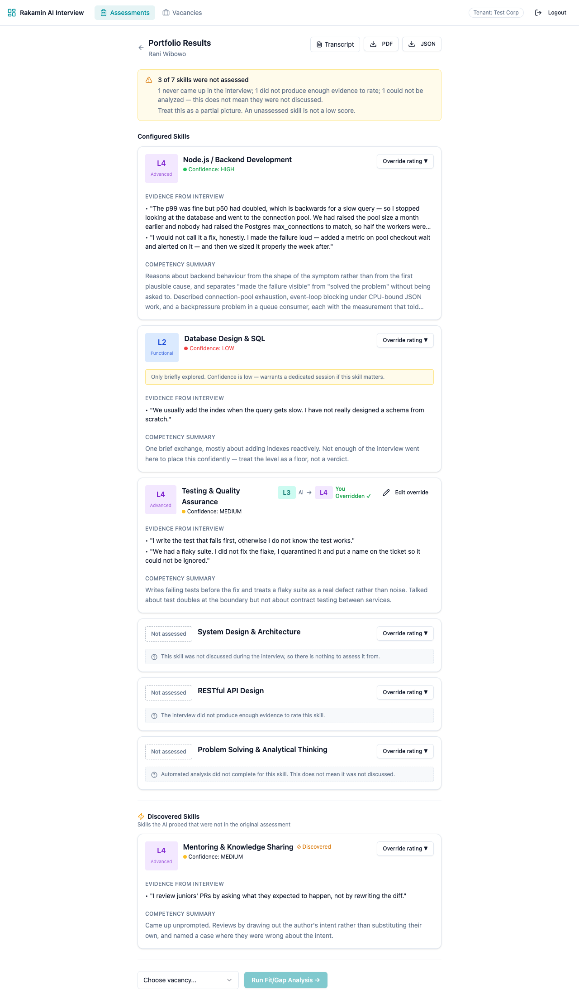
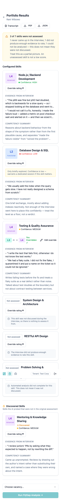
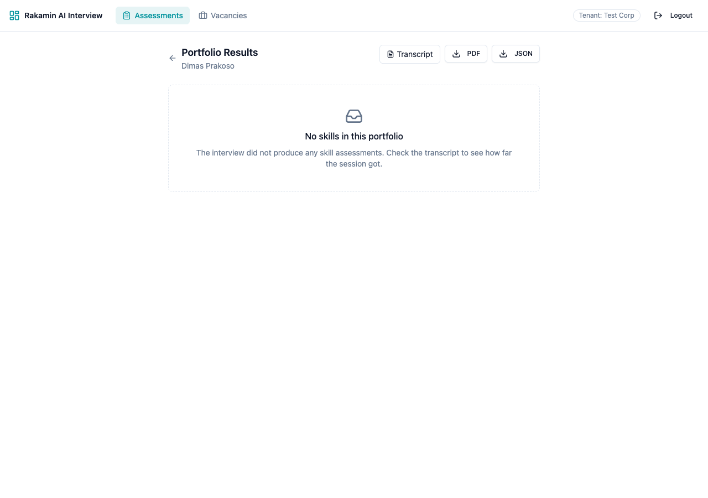
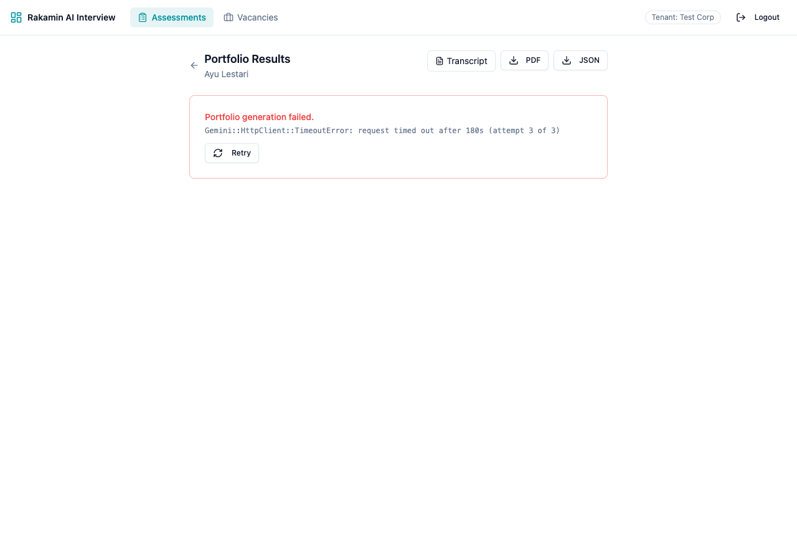
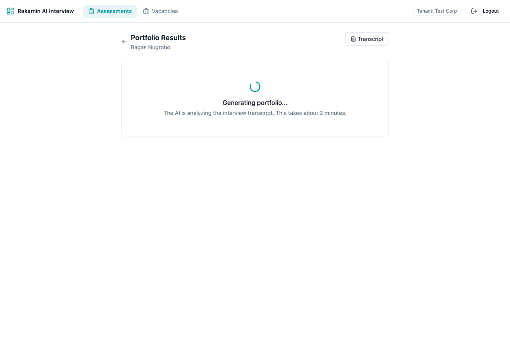
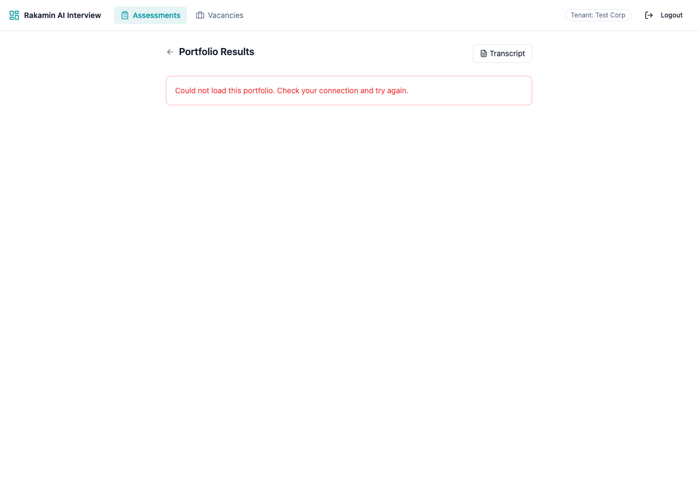
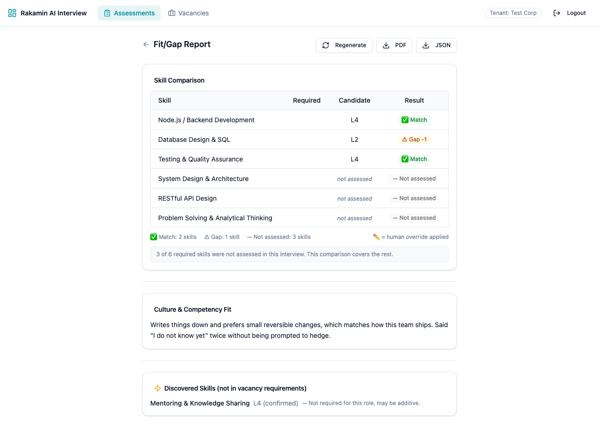
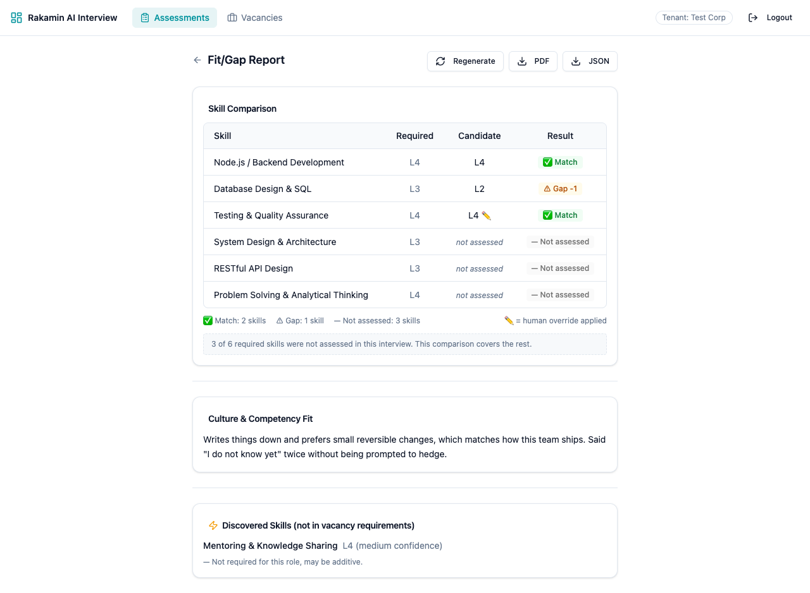

# Ratings this product cannot defend

**Case Study — Fullstack Product Engineer**
Husen Efendi · 16 August 2026

---

## The short version

An AI interview platform exists to produce one thing: a rating a human being can defend in a hiring conversation. This one produced ratings it could not defend, in three independent ways, and showed them to recruiters with no mark to distinguish them from real ones.

A skill the model never rated was stored as **Level 1** — the bottom of the scale. A skill the interview never reached was stored as **Level 2**. A skill the model rated 99 was stored as **Level 5**. None of these were errors the recruiter could see. They rendered as ordinary badges next to genuine assessments.

And any assessor with valid credentials could read every other organisation's candidates by adding one header to their login request.

I fixed the fabrication at its source, made "not assessed" a state the database, the API, and the screen can all express, closed the tenant boundary, and built the test harness that proves it — the repository had no specs, no frontend test runner, and no CI when I started.

| | Before | After |
|---|---|---|
| RSpec examples | 0 | **67** |
| Frontend tests | no runner installed | **48** |
| CI | none | RSpec + Vitest + `tsc` on every PR |
| Ratings the AI never gave | stored as Level 1 | stored as *not assessed*, with the reason |
| Cross-tenant portfolio access | 200 / 201 / 202 | 404 |
| Tenant named by the caller | honoured | ignored |

**Claimed depth: backend-heavy.** The data model was where the lie originated, so that is where most of the work is. The frontend slice is complete rather than deep — every interaction state the rubric names is handled, and the client's own independent copy of the fabrication bug is removed.

**Links**

| | |
|---|---|
| **Umbrella pull request** | [rakamindev/ai-interview-platform#20](https://github.com/rakamindev/ai-interview-platform/pull/20) |
| **Video walkthrough** (3–5 min) | `<<VIDEO_URL>>` |
| Sub-PR #4 | [Add a working dev environment and test harness](https://github.com/husenEF/ai-interview-platform/pull/4) |
| Sub-PR #5 | [Scope portfolios to their tenant](https://github.com/husenEF/ai-interview-platform/pull/5) |
| Sub-PR #6 | [Stop inventing ratings the AI never gave](https://github.com/husenEF/ai-interview-platform/pull/6) |
| Sub-PR #7 | [Make "not assessed" visible instead of scoring it a 1](https://github.com/husenEF/ai-interview-platform/pull/7) |
| Sub-PR #8 | [Bind a user to their organization instead of asking the client](https://github.com/husenEF/ai-interview-platform/pull/8) |
| Seeded fault | [`spike/seeded-fault`](https://github.com/husenEF/ai-interview-platform/tree/spike/seeded-fault) — pushed and kept |

The sub-PRs live on the fork. A pull request's base branch cannot cross repositories, so pointing them at `rakamindev:main` would have made each one carry the whole stack and lose the single-argument shape that is the reason for splitting them.

---

## Step 1 — Setup and local exploration

The repository README describes running each service directly on the host. I built a Docker Compose stack instead — Postgres, Redis, Rails, Sidekiq, Vite — because the first thing I needed was the ability to destroy the database and rebuild it from nothing, repeatedly and without ceremony. That turned out to matter more than I expected; see the AI verification moment below, which was only diagnosable because rebuilding from empty was a single command.

The baseline, confirmed rather than assumed:

- `api/spec` contained no specs. RSpec was in the Gemfile and had never been run.
- `web` had no test runner at all. No Vitest, no Jest, no testing-library.
- No CI workflow.

The brief calls this out, so I read it as part of the exercise rather than an oversight to work around: *"building enough testing harness to prove your work is part of owning the change."*

So the first branch is not a feature. It is the harness — Compose stack, RSpec with FactoryBot / DatabaseCleaner / WebMock, Vitest with React Testing Library, a Makefile, and a GitHub Actions workflow. Nothing after it would have been provable otherwise.

One harness decision worth naming, because it is a guard against a specific failure I hit: `spec/harness_spec.rb` asserts things about the harness itself — that every factory builds, that `organizations` resolves to exactly one table in the `public` schema, and that outbound HTTP is blocked so no spec can reach the real Gemini API. When one of those silently stops holding, other specs fail in ways that look like product bugs. I know, because that is exactly what happened to me.

---

## Step 2 — Deep context

### The product

An assessor configures a set of skills with level anchors, a candidate is interviewed by an AI over voice, and the system produces a skill portfolio: a level from 1 to 5 per skill, a confidence, quoted evidence from the transcript, and a competency summary. That portfolio can then be compared against a vacancy to produce a fit/gap report.

The product's actual output is not the interview. It is **a number attached to a person's name**, used by someone who was not in the room.

### The industry

Screening in Indonesia is a volume problem. A single opening draws hundreds of applicants, and the scarce resource is senior attention — the hours of someone who can tell a good engineer from a confident one. Everything upstream of that is commoditised: job boards, ATS pipelines, aptitude tests. Structured skill evidence is not commoditised, and that is where this product sits.

Which sets the bar. A tool that saves a recruiter time by producing ratings they cannot trust has not saved anyone time; it has moved the work to whoever discovers the mistake, usually the candidate, usually too late.

### What it is for

The outcome is a hiring decision that is better than the one made without it. For that to keep being true, one thing has to hold: **the portfolio has to be an honest account of what the interview established, including where it established nothing.** An assessment that quietly fills its own gaps is worse than no assessment, because it is trusted.

### The users

Assessors and recruiters read these screens between other tasks, quickly, looking for a reason to advance or reject. They will not cross-check a level against the transcript. The screen has to be readable at a glance and it has to be honest at a glance — those are the same requirement.

The override feature says the product already knows this: a human is expected to disagree with the AI sometimes. But override was only reachable on skills the AI had rated. The skills most in need of human judgement — the ones the AI could not rate — were the ones a human could not touch. Fixing that is part of this work.

### The people affected who never chose it

A candidate does not select this tool, cannot opt out of it, and cannot see what it said about them. A wrong result costs them a job.

Under Indonesia's **UU No. 27/2022 (PDP)** this is not only an ethical point:

**Accuracy.** Interview transcripts, quoted evidence, and skill ratings are personal data. A data subject has the right to have inaccurate data corrected. A stored Level 1 for a skill that was never discussed is not an approximation — it is a factual claim about a person that no process ever made. The platform was manufacturing inaccurate personal data by design and using it in a decision about that person.

**Automated decisions.** The assessor override is the human-in-the-loop that keeps this from being a purely automated decision. It has to work precisely where the AI failed, or the loop is open exactly where it is most needed. This is why the migration in PR #6 also relaxes `assessor_overrides.ai_level` to nullable: an override recording "the AI gave no level, I am giving one" has to be representable.

**Data minimisation and disclosure.** The cross-tenant defects meant one organisation's assessors could read another organisation's candidate transcripts. That is unlawful disclosure of personal data, and it required no privileged access — one HTTP header.

I checked that no personal data or secrets appear in logs or commits. Fixture candidates are invented.

---

## Step 3 — Problem and gap analysis

The brief asks findings to be separated into **missing specification** (never defined) and **defective implementation** (defined but broken). That split turned out to be the most useful lens in the whole exercise, because it predicts the shape of the fix: defective implementation is a patch, missing specification is a migration.

### P0 — Missing specification

**M1 · The schema had no way to say "not assessed".**
`portfolio_skills.ai_level` was `NOT NULL` with a `1..5` check constraint. There is no value in that domain meaning "no rating". Every downstream fabrication follows from this: given a column that must hold 1–5 and a model that returned nothing, the code had no honest option. *Impact: the product cannot distinguish "we found nothing" from "we found the lowest thing", so neither can the recruiter.*

**M2 · A user's organisation was never recorded.**
`users` had no tenant column. Nothing in the service knew which organisation an assessor belonged to. So login asked the client — see D1. *Impact: the tenant boundary had no data to rest on.*

### P0 — Defective implementation

**D0 · The application cannot boot in production.** Numbered zero because it was found last and outranks everything below it: none of the other defects matter on a process that never starts.

`app/channels/audio_websocket_middleware.rb` defines `AudioWebSocketMiddleware`. That path obliges it to define `AudioWebsocketMiddleware` — Zeitwerk derives the constant from the filename, and `websocket` camelizes to `Websocket`, not `WebSocket`. Same mismatch in the coverage middleware beside it.

Nothing noticed, because nothing ever loaded the file eagerly:

```ruby
# config/environments/development.rb
config.eager_load = false
# config/environments/test.rb
config.eager_load = ENV["CI"].present?
# config/environments/production.rb
config.eager_load = true
```

On a developer machine every file loads lazily and the two that Zeitwerk cannot resolve are simply never reached. Eager loading walks them and raises `NameError` during boot — before the first request, in the only environment that serves real traffic.

*Impact: deploy fails, or worse, succeeds into a crash loop. The whole test suite passes while this is true.*

**How it was found is the point.** I did not read it. GitHub Actions sets `CI=true`, which flipped `eager_load` on, and the api job failed on a repository whose suite was green on my machine 66 times. That is the harness from PR #4 paying for itself on its first real run — and it is the strongest argument I can make that CI belongs in this submission rather than being a checkbox.

The fix renames the two files to `*_web_socket_middleware.rb` so the paths match the class names already in use. `harness_spec.rb` now calls `Rails.application.eager_load!` directly rather than trusting the environment flag, so the guard holds on a laptop too. I checked that the guard fails on the original filenames before keeping it.

**D1 · Login let the caller choose their own tenant.**

```ruby
def resolve_scheme
  request.headers['X-Tenant-Scheme'].presence ||
    ActiveRecord::Base.connection.select_value('SELECT scheme FROM organizations LIMIT 1') ||
    'test-corp'
end
```

Every authorization check in this service reads the `scheme` claim out of the JWT. That claim was minted here, from a request header. Log in with your own valid credentials plus `X-Tenant-Scheme: victim-corp` and the server issues a **correctly signed** token scoped to that organisation. Nothing downstream can tell it from a legitimate one: the signature is real, the user is real, the expiry is real. Only the tenant is false, and the tenant is what every check reads.

*Impact: full cross-tenant read and write for the token's three-day life, obtained with one header. The frontend has never sent that header — it existed only to be abused.*

Without the header, the fallback was `SELECT scheme FROM organizations LIMIT 1` — no `ORDER BY`, no reference to the user signing in. Two assessors from different organisations received the same tenant, whichever row Postgres returned first.

**D2 · The API manufactured ratings the model never gave.**

```ruby
skill_data['level'].to_i.clamp(1, 5)
```

`nil.to_i` is `0`; `0.clamp(1, 5)` is `1`. The expression reads like defensive input validation. It is a rating generator. Measured against the original code before any fix:

| Model returned | Stored as |
|---|---|
| `null`, `"abc"`, missing key, `0` | **Level 1** |
| `99` | **Level 5** |
| skill never probed (`coverage_state: not_yet`) | **Level 2** |

*Impact: a candidate is rated on skills the interview never touched, at the bottom of the scale, and no one downstream can tell.*

**D3 · Cross-tenant IDOR on portfolio endpoints.**

| Endpoint | Expected | Actual |
|---|---|---|
| `GET /portfolios/:id/export` | 404 | **200** |
| `POST /portfolio_skills/:id/override` | 404 | **201** — cross-tenant *write* |
| `POST /portfolios/:id/fitgap` | 404 | **202** |

`Portfolio` was not tenant-scoped, and lookups went by bare `id`. *Impact: candidate transcripts readable and gradeable across organisations.*

**D4 · The frontend fabricated Level 1 independently.**

```ts
return isNaN(n) ? 1 : n;
```

The client half of D2, in a different language, invented at a different time. Fixing only the API would have left the fabricated 1 on screen. *Impact: the seam the brief names explicitly — data computation versus frontend presentation — was producing the same lie twice, so neither fix alone was sufficient.*

### P1

**D5 · `TenantScoped` fails open outside a request.** See the constraint signal below.

**D6 · The fit/gap "Required" column rendered blank on every row.** The frontend read `required_level`; the API sends `expected_level`. So "Gap −1" was displayed with nothing to compare it against. *Impact: the central table of the fit/gap report was missing half its data, and the type declaration asserted a shape the API has never sent — the same class of failure as D4.*

**D7 · `(confirmed)` printed for skills nothing had judged.** `s.ai_confidence === "low" ? "low confidence" : "confirmed"` — any confidence that was not `"low"`, including `null`, fell through to the strongest claim available.

**D8 · `ConfidenceIndicator` rendered "LOW" for null confidence**, claiming low confidence about a judgement that never happened.

**D9 · The Rack::Attack throttle store shares Redis database 1 with Sidekiq's queues.** Not exploitable, but it means the obvious way to reset throttles in a test (`cache.store.clear`) flushes the job queue. I hit this and worked around it with `Rack::Attack.reset!`, which deletes only its own prefix.

**D10 · `rails_helper` used `ENV['RAILS_ENV'] ||= 'test'`.** The container sets `RAILS_ENV=development`, so `||=` never fired and a bare `bundle exec rspec` ran the entire suite — DatabaseCleaner included — against the **development database**, truncating it. I found this the way you would expect: login stopped working and I could not explain why.

### P2

**D11 · The portfolio page handled only the happy path** — no empty state, no partial state, generation errors swallowed rather than shown.
**D12 · The app header forced a 550px minimum width on every page**, breaking layout at 375px.
**D13 · `res.data as any`** in two pages, which is what allowed D6 to exist undetected.

### P3

**D14 · `AuthorizeApiRequest` never touches the database.** A user deleted or demoted keeps full access until their token expires — up to three days.
**D15 · `TenantResolverMiddleware` decodes the JWT without verifying the signature** to read the scheme claim. Authenticated endpoints still reject the forged token afterwards, so this is not directly exploitable there, but unauthenticated candidate flows resolve their tenant from it.

### Constraint signal

**`TenantScoped` fails open, and Sidekiq workers therefore run unscoped.**

```ruby
default_scope do
  if RequestStore.store.key?(:tenant_id)
    where(tenant_id: Current.tenant_id)
  else
    all          # ← no tenant in scope? return everything
  end
end
```

`RequestStore` is populated by Rack middleware. A Sidekiq worker has no Rack request, so the key is absent, so every tenant-scoped model returns **all rows across all organisations** inside every background job. `Portfolios::GeneratorWorker` and `CoverageAnalyzerWorker` both run there.

**I did not fix this, deliberately, and this is the item I would escalate to a Technical Lead before touching.** Making it fail closed is one line. The consequences are not one line:

- Every worker, rake task, console session, and seed script currently depends on the open behaviour. Failing closed turns them all into silent no-ops — `Portfolio.find(id)` inside a job returns nothing and the job succeeds having done nothing. That is a worse failure than the one it replaces, because it is invisible.
- The correct fix is to pass tenant explicitly into every job and establish it at the job boundary, which is a cross-cutting change to every worker and every enqueue site.
- The exposed surface today is HTTP, and PRs #5 and #8 close it. A background job is not reachable by an attacker; it is reachable by a bug.

So: the attack surface is closed, the latent defect is documented, and the fix is scoped rather than smuggled into a deadline. Shipping a one-line change that silently empties every background job would have been the worse engineering decision, and I would rather defend that choice than hide it.

---

## Step 4 — Strategy, acceptance criteria, trade-offs

### Acceptance criteria, derived before writing code

For rating ingestion — written as a table of inputs first, then turned into specs one by one:

| Model output | Required behaviour |
|---|---|
| `3`, `"3"`, `3.0` | Level 3, confidence as given |
| `nil`, `""`, `"abc"`, `{}`, `[]` | Not assessed — `insufficient_evidence` |
| `0`, `-1`, `99` | Not assessed — **not** clamped into range |
| `2.5` | Not assessed — a non-integer level is not an answer to the question asked |
| level present, `coverage_state: not_yet` | Not assessed — `never_probed`; coverage is authoritative over the model |
| level present, unrecognised confidence | Level kept, confidence recorded as `low`, never as the model's invented string |
| model call times out or errors | Not assessed — `analysis_failed`, error text preserved |

Clamping deserves its own line, because clamping is the tempting choice and it is wrong. Rounding 99 down to 5 does not recover a judgement; it presents a parse failure as an assessment of a candidate, and picks the top of the scale to do it.

For the screen:

- An unassessed skill shows no number anywhere, and its badge is visually distinct from L1 — not a neutral fill, which is what L1 already uses.
- Each of the three reasons reads differently, because they mean different things to a recruiter: *never came up*, *not enough evidence*, *analysis failed*. The third explicitly says it does **not** mean the skill was not discussed.
- Evidence and confidence are hidden rather than shown empty.
- Override remains available on unassessed skills.
- Coverage is stated numerically up front: *"3 of 7 skills were not assessed."*
- Loading, empty, error, partial, long text, and 375px are each handled.

### Trade-off 1 — how to represent "not assessed"

| | **A · Sentinel value** | **B · Nullable + reason + XOR constraint** *(chosen)* | **C · Derive in the API layer** |
|---|---|---|---|
| Shape | Keep `NOT NULL`, widen the check to allow `0` | `ai_level` nullable, `not_assessed_reason` enum, check constraint enforcing exactly one | Schema untouched; API infers "not assessed" by joining `coverage_maps` at read time |
| Product impact | Recruiter still sees a number; "0" reads as a score | Absence is a first-class state end to end, with a reason worth reading | Correct on screen, still wrong in the database and in every export |
| Cost | Lowest | One migration, one domain object, ~1 day | Medium, and repeated at every read site |
| Maintainability | Every consumer must remember 0 is magic; nothing enforces it | The database refuses to store a contradiction; a new consumer cannot get it wrong | Inference logic drifts from the data it infers from |
| Failure modes | One forgotten `if level == 0` and the sentinel is displayed as a rating | `down` must handle rows the old schema cannot represent — handled with an explicit `IrreversibleMigration` and a message | Anything reading the table directly — SQL exports, BI, the PDF export — sees the fabricated value |
| Forecloses | Recording *why* | Nothing | A real fix later; the bad data keeps accumulating meanwhile |

**Why B.** The failure being fixed is a false statement stored in a database. A fix that leaves the false statement in the database and corrects it on the way out is not a fix, it is a display filter — and this product exports to PDF and JSON, so there are read paths that would never see the filter. The XOR constraint is the part that makes it durable: a row asserting both a level and a reason, or neither, is rejected by Postgres regardless of which code path wrote it.

Option A is what the codebase would have nudged me toward and is the reason I wrote the option table before the code.

### Trade-off 2 — how to bind a user to a tenant

| | **A · Delete the header only** | **B · Add `users.tenant_id`** *(chosen)* | **C · Derive from email domain** |
|---|---|---|---|
| Product impact | Closes the header hole; two assessors from different orgs still collide | Each user gets their own organisation's data | Appears to work until one org uses gmail addresses |
| Cost | Minutes | One migration, backfill, four specs | Low |
| Maintainability | The `LIMIT 1` guess remains, now the only path | The `NOT NULL` forces the question at user creation | Silent, unfixable coupling to email providers |
| Failure modes | Non-deterministic tenant, no error | Backfill must not move existing users | Cross-tenant access via an email address |

**Why B, and how the backfill was chosen.** The backfill deliberately reproduces the old implicit rule — lowest-id organisation — rather than guessing something smarter. Existing rows keep the tenant they have effectively been using, so the security hole closes without a silent data migration riding along with it. Assigning users to their real organisations is an operational task requiring information this service does not have; `NOT NULL` is what makes the next person confront it rather than inherit the guess.

### Trade-off 3 — pull request shape

The brief offers this one directly. I chose **Option B, an umbrella PR with focused sub-PRs**, because the change spans two independent defect clusters plus a harness that neither depends on. A reviewer can read "stop inventing ratings" without also reading Docker Compose. The umbrella carries the reasoning; each sub-PR carries one argument and its tests.

The cost is real: five PRs is more process, and the stack must be merged bottom-up with merge commits — squashing would destroy it, since each branch is built on the previous one's SHAs. I judged reviewability worth that, on a change whose whole point is that it should be checkable.

---

## Step 5 — Implementation

Five branches, each stacked on the last.

**[#4 · Dev harness](https://github.com/husenEF/ai-interview-platform/pull/4)** — Compose stack, RSpec + FactoryBot + DatabaseCleaner + WebMock, Vitest + React Testing Library, Makefile, GitHub Actions. Includes `harness_spec.rb`, which guards the harness's own assumptions.

**[#5 · Tenant isolation](https://github.com/husenEF/ai-interview-platform/pull/5)** — `portfolios.tenant_id` added and backfilled from the parent session; `Portfolio` becomes `TenantScoped`; the three IDOR endpoints return 404. Written as failing request specs first.

**[#6 · Rating integrity](https://github.com/husenEF/ai-interview-platform/pull/6)** — the `Assessments::Rating` value object; `ai_level` nullable; `not_assessed_reason` as a Postgres enum; `chk_portfolio_skills_rating_xor` enforcing exactly one of the two; overrides allowed on unassessed skills; `analysis_error` preserved on coverage maps.

**[#7 · Portfolio states](https://github.com/husenEF/ai-interview-platform/pull/7)** — `parseLevel` stops fabricating; three lying types corrected; `LevelBadge`, `SkillPortfolioCard`, `ConfidenceIndicator` handle absence; `CoverageBanner`; every interaction state; `usePortfolioReport` extracted; D6 and D7 fixed; `as any` removed.

**[#8 · User tenancy](https://github.com/husenEF/ai-interview-platform/pull/8)** — `users.tenant_id`, login reads the user's own organisation, the header is ignored.

### Designed failure paths

- **Model timeout or error** → `analysis_failed`, error text preserved on the coverage map and quoted verbatim on screen rather than replaced with "something went wrong".
- **Partial generation** → the portfolio renders what exists and states what does not, rather than failing whole or succeeding silently.
- **Fetch failure vs generation failure** are separate states on the page. A network blip is not a failed assessment, and telling the user it was would send them to regenerate something that is fine.
- **Migrations** are reversible and safe against existing rows. Where a rollback cannot preserve meaning — rows saying "the AI gave no level", which the old `NOT NULL` schema cannot represent — `down` raises `IrreversibleMigration` with a message naming the count and the reason, rather than inventing a level on the way back down.
- **Duplicate jobs** — regeneration is guarded by status: the endpoint accepts only a portfolio already in `failed`, so a second request while one is in flight is rejected rather than enqueueing a competing generation. That guard is the existing codebase's, and I verified it rather than changed it. It did change one thing I had built: my first version of the empty state offered a Regenerate button, which on a portfolio that generated successfully and simply found nothing would have called an endpoint that always refuses. The button is gone. An offer the product cannot honour is worse than no offer.

### Interaction states



*The state this whole change exists to produce. Three skills are marked "Not assessed" with a dashed outline badge — deliberately unlike L1's filled neutral — each with the reason in a sentence. The banner counts them before the reader reaches the cards. "Analysis failed" says explicitly that it does not mean the skill was not discussed. Note that override remains available on all three.*


*375px. The header previously forced a 550px minimum on every page.*


*Empty — the interview produced no skills at all. Previously this rendered the "Configured Skills" heading over nothing.*


*Generation failure, with the underlying error quoted rather than swallowed.*


*Generation in progress, polling.*


*Fetch failure — deliberately a different state from generation failure.*


*Fit/gap before the last two fixes: the **Required** column is empty on every row, so "Gap −1" has nothing to compare against, and the discovered skill reads "L4 (confirmed)".*


*After: Required populated, unassessed rows shown as their own result, the count stated below the table so "Match: 2" cannot stand in for the whole picture, and confidence reported honestly.*

---

## Verification

### Test coverage

**67 RSpec examples, 48 Vitest tests, `tsc --noEmit` clean, `npm run build` succeeds.** The backend suite was run three times under different random seeds to confirm it is order-independent — that check is what surfaced D9. It was also run with `CI=true`, which turns eager loading on, after D0 showed that the two configurations are not the same suite.

Coverage is layered rather than duplicated: `Assessments::Rating` is tested directly against all nine malformed inputs, and `Portfolios::Generator` is tested separately through the real service, so the guarantee is checked both where it is implemented and where it is relied on.

### Seeded fault

A suite that has only ever been green proves the code passes the tests. It does not prove the tests would notice if the code were wrong. So on [`spike/seeded-fault`](https://github.com/husenEF/ai-interview-platform/tree/spike/seeded-fault) I put the original defect back — both halves, verbatim — and ran the suites again. The branch is pushed and kept.

| Suite | Normal | Fault seeded |
|---|---|---|
| RSpec | 62 examples, 0 failures | **62 examples, 14 failures** |
| Vitest | 48 tests, 0 failures | **19 failed, 29 passed, 2 uncaught exceptions** |

*(The spike branches from the portfolio-states work, which is why it counts 62 RSpec examples rather than the 66 above — the four login-tenancy specs came later and are unrelated to this defect.)*

Three things in that output matter more than the counts.

**The failures name the defect.** They do not read `expected 1, got nil`. They read *"refuses to invent a level from nil"*, *"does not invent a rating from a non-numeric level (the model returned prose where a level belongs)"*. A test whose name describes the bug tells the next person what broke without opening a file.

**Both halves fail independently**, which is the evidence that D2 and D4 were genuinely two defects and not one.

**The client half fails louder than I expected.** Vitest reported two uncaught exceptions on top of the assertion failures:

```
TypeError: Cannot read properties of null (reading 'replace')
 ❯ Module.parseLevel src/utils/constants.ts:11:40
 ❯ SkillPortfolioCard src/components/portfolio/SkillPortfolioCard.tsx:27:19
```

That is the crash that would have shipped if the API fix had merged without the frontend one — `parseLevel(null)` throws and the portfolio page white-screens. It is also why PRs #5 and #6 were held unmerged until #7 was ready. The suite located it in the exact component that would have taken the page down.

Verbatim output is committed at `assessment/seeded-fault/` on that branch.

### Live verification

Specs are not the whole story, so the tenant fix was also exercised against the running stack:

```
$ curl -s -X POST localhost:3001/api/v1/auth/login \
    -H 'X-Tenant-Scheme: victim-corp' \
    -d '{"email":"assessor@test-corp.local","password":"..."}'

{"token":"...","user":{...}}          # decoded claim: scheme = "test-corp"
```

The header is ignored. Every portfolio state in the screenshots above was confirmed in a browser against the real API, not only in jsdom.

Migrations were rolled back and re-applied with rows present, and the full `db:drop db:create db:migrate db:seed` path was verified from an empty database.

### AI verification moment

I use AI heavily. This is the instance where it was confidently wrong and I nearly shipped the correction.

**What I believed.** Every authenticated endpoint was returning 403 "Tenant not found". Investigating with AI assistance, I concluded there was a P0 tenant-resolution bug: `organizations` existed in two schemas, `Organization.table_name` is unqualified, and `search_path` was resolving to the empty copy in `ai_interview`. The diagnosis was coherent, the symptom matched, and I wrote the fix — schema-qualify the table, plus a guard in the resolver. It would have been a plausible-looking commit.

**Why it was wrong.** The second schema was mine. My own `infra/postgres-init.sql` created the `ai_interview` schema up front. But migration `20231201000000_create_organizations` runs **before** `20240101000000_create_ai_interview_schema`, and depends on that schema not existing yet: Postgres silently skips schemas absent from `search_path`, so while `ai_interview` was missing, `"ai_interview,public"` resolved to `public` and the table landed there — which is correct, because `rakamin-api` owns that table. By pre-creating the schema I inverted the ordering, put `organizations` in the wrong place, and then diagnosed the symptom as a product bug.

**How I caught it.** Reading the migration timestamps in order, rather than reading the runtime state. The ordering only makes sense if the schema is meant to be absent.

**How I verified.** Deleted the volume and ran the **original, unmodified** repository code: one `public.organizations`, login 200, every endpoint 200, `schema.rb` unchanged. Both "fixes" were reverted.

**What I changed as a result.** The ordering is now asserted by a spec in `harness_spec.rb`, so the next person to add an init script gets a named failure instead of a day of debugging. And I stopped taking a matching symptom as confirmation of a cause — the AI's explanation fit the evidence perfectly and was still wrong about the direction of causation.

The general lesson I would defend: **a fix that does not fix anything cannot be explained in review.** The way to catch one is to reproduce the failure on unmodified code first. I did not do that, which is why this took a day.

Two smaller cases in the same category, both found by tests rather than by reading:

1. `default_scope { where(tenant_id:) }` **seeds `tenant_id` into newly built records**, so `self.tenant_id ||= Current.tenant_id` never fires. The generated code looked right; the spec disagreed.
2. `Session` is itself tenant-scoped, so `portfolio.session` returns `nil` when the ambient tenant differs — the backfill had to read `unscoped`.

---

## Assumptions

The brief says to make reasonable assumptions and write them down.

1. **Confidence is not a level.** An unrecognised confidence string is not worth discarding a real level over, so the level is kept and confidence is recorded as `low` — but never stored as whatever string the model invented.
2. **Coverage state outranks the model.** If `coverage_state` says a skill was never probed, it is `never_probed` regardless of how confident the model sounds. The model is asked to rate every skill in the map and has no way to decline, so it will always produce a number.
3. **Integer-valued floats are accepted** (`3.0` → 3). JSON has one number type and some models emit floats. `2.5` is rejected.
4. **The backfill preserves current behaviour rather than guessing better.** Discussed above under Trade-off 2.
5. **Non-integer and out-of-range levels are "insufficient evidence", not a separate reason.** A fourth enum value for "the model returned garbage" would be more precise and is not information a recruiter can act on differently.
6. **The report is written in English** to match the codebase, its comments, and the pull requests.

---

## What I would do next

In priority order, if this were a live project:

1. **Make `TenantScoped` fail closed**, with tenant passed explicitly into every job and established at the job boundary. The constraint signal above.
2. **Look up the user in `AuthorizeApiRequest`** so a deleted or demoted account loses access immediately rather than in three days (D14).
3. **Assign users to their real organisations** — the operational task that `users.tenant_id NOT NULL` now forces into the open.
4. **Give the candidate a view of their own portfolio.** They are the data subject; under UU PDP they have rights of access and rectification, and the product currently has no surface for either.
5. **Move the throttle store off Sidekiq's Redis database** (D9).

---

*Repository: [github.com/husenEF/ai-interview-platform](https://github.com/husenEF/ai-interview-platform) · Branches are preserved, including the seeded-fault spike.*
